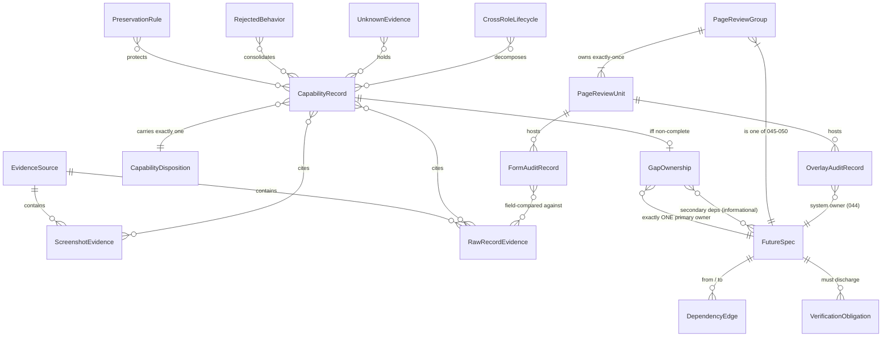

# Spec 042 — Data Model (Phase 1): The Documentation-Domain Model

**Status**: `/speckit.plan` Phase-1 artifact. **Documentation-domain ONLY** — this models how the Spec-042
evidence corpus is structured so Specs 043–057 can consume it. It is NOT an application database model:
no migrations, no ORM, no backend proposal, no schema that ever executes. Governed by `plan.md` D1–D14
(D1 stable IDs · D2 precedence · D3 disposition semantics · D4 57-vs-58 · D7 partition immutability).

**Canonical stores** (every entity below LIVES in a committed specify-phase artifact; this file only names
the shape — it never duplicates a row):
audits `cluster-audits/C01..C15-audit.md` · paths `cluster-evidence-paths/C01..C15-paths.md` · ledger
`legacy-current-capability-ledger.md` · allocation `future-spec-allocation-register.md` · partition
`page-review-ownership-map.md` · rejections `rejected-legacy-behaviour-register.md` · unknowns
`unknown-and-conflicting-evidence-register.md` · preservation `current-product-better-than-legacy-register.md` ·
lifecycles `cross-role-propagation-map.md` · forms `forms-completeness-ledger.md` · overlays
`modal-drawer-interaction-ledger.md` · states `empty-loading-error-state-ledger.md` · privacy
`privacy-and-sensitive-data-findings.md` · evidence index `exhaustive-evidence-inventory.md` · counts
`count-and-impact-contract.md` · tests `protected-test-carryover.md` · roles `role-surface-reconciliation.md` ·
routes `page-and-route-reconciliation.md`.

---

## 1. Entity relationship overview

---

## 2. The 17 entities

### E1 — EvidenceSource

The frozen corpus roots. Everything a future spec may ground in.

- **Identifier**: root path (relative to `academy-dashboard-discovery/`).
- **Instances (closed set)**: `output/roles/<role>/pages/` (339 records: 300 admin · 26 teacher · 13 family) ·
  `output/roles/<role>/screenshots/` (1,113 crawler PNGs) · `output/roles/<role>/text/` ·
  `output/roles/<role>/html/{raw,sanitized}/` (339+339) · `app/screenshots/` (current-product frames) ·
  `app/src/` + `app/public/` (current source + built output, read-only) · `output/combined/` (indexes).
- **Required fields**: root path · role (`admin|teacher|family|current-app|combined`) · media type ·
  census figure (per `exhaustive-evidence-inventory.md` §"Files by type").
- **Invariants**: (i) the corpus is FROZEN — no re-crawl inside 043–057 except where a UK row demands NEW
  evidence (e.g. UK-01 unauthenticated crawl, owner 043); (ii) precedence per D2 and the standing rule:
  raw records beat summaries, pixels + raw forms beat module tags, shipped code beats stale spec artifacts;
  (iii) reconciliation totals (679 sitewide HTML, 346 JSON, 359 MD, 1,162 mirror images) resolve exactly as
  recorded in `exhaustive-evidence-inventory.md` — never re-derived loosely.
- **Relationships**: 1‑to‑many with ScreenshotEvidence and RawRecordEvidence.

### E2 — ScreenshotEvidence

One image file. **A filename is not inspection.**

- **Identifier**: full path (e.g. `output/roles/teacher/screenshots/teacher-home-full.png`).
- **Required fields**: path · role · legacy page slug (or current-app frame id) · variant (`-full`,
  interaction `-NNN`, viewport) · **opened-as-image flag** · **opened-by** (which audit/agent actually
  rendered the pixels — recorded in the citing audit's method note, e.g. a C-audit "screenshots opened"
  statement or the visual audit's frame list).
- **Invariants**: (i) a capability or visual claim may cite a screenshot ONLY if some audit records having
  OPENED it as an image — listing a filename from `ls` proves nothing; (ii) 1,113 crawler screenshots is a
  frozen census; (iii) error-page captures (the C14 500/504/404 corpus) prove only the error, never the
  feature (feeds UnknownEvidence, e.g. UK-02…UK-07).
- **Relationships**: belongs to one EvidenceSource; cited by CapabilityRecord, PreservationRule,
  RejectedBehavior, FormAuditRecord, VerificationObligation (screenshot-loop acceptance).

### E3 — RawRecordEvidence

One machine-readable crawl record. **Beats every summary.**

- **Identifier**: full path (e.g. `output/roles/admin/pages/management-settings-notification.json`).
- **Required fields**: path · role · slug · format (`json|md|txt|html-raw|html-sanitized`) · httpStatus
  where recorded · payload facets used (`forms[].fields[]`, `tables[]`, `buttons[]`, `modals`).
- **Invariants**: (i) 1,723 raw records is the frozen census; (ii) precedence: `forms[].fields[]` and
  `html/raw/*.html` are the field-level ground truth (the forms ledger method); (iii) an
  `isErrorPage: true` / 500 / 504 record is a NEGATIVE capture → UnknownEvidence, never a capability;
  (iv) a record is cited by path + facet (e.g. `…-permission-6.json → forms[1].fields[]`), never pasted.
- **Relationships**: belongs to one EvidenceSource; cited by CapabilityRecord, FormAuditRecord,
  RejectedBehavior, CrossRoleLifecycle, UnknownEvidence.

### E4 — CapabilityRecord

One row of the normalized capability ledger. **380 instances**; the ledger equals the 15 audits exactly.

- **Identifier**: `Cnn-mm` (cluster `C01…C15` · row `mm`), e.g. `C07-13`, `C08-09`. Frozen.
- **Required fields**: capId · cluster · capability statement · evidence refs (≥1 ScreenshotEvidence or
  RawRecordEvidence path+facet) · current-product surface (page/component/`—`) · disposition (E5) ·
  owner (only when non-complete → the GapOwnership row) · anchor (the audit table row it lives in).
- **Invariants**: (i) census 380 total = 153 not-allocated (17 COMPLETE_AND_VERIFIED · 16
  COMPLETE_BUT_VISUAL_REVIEW_REQUIRED · 57 INTENTIONALLY_IMPROVED · 63 REJECTED_\*) + 227 allocated
  (96 PARTIAL · 58 MISSING · 40 FUTURE_BACKEND · 28 UNKNOWN_EVIDENCE · 5 HONEST_LOCK) — per the allocation
  register §2; (ii) the 5 HONEST_LOCK rows (C03-14 · C06-13 · C07-23 · C08-08 · C09-23) are ONE physical
  lock (`classSalaryReport`) seen from five clusters — never "five locks" (D3); (iii) a row's disposition
  never changes inside 042; a future spec changes it only by declared supersession citing the capId.
- **Relationships**: exactly one CapabilityDisposition; 0-or-1 GapOwnership; consolidated by
  RejectedBehavior / UnknownEvidence / PreservationRule rows (each such row lists its capIds).

### E5 — CapabilityDisposition

The closed 12-value enum + interpretation law. **A verdict, never a backlog state.**

- **Identifier**: the word itself. **Closed set (exactly 12)**: `COMPLETE_AND_VERIFIED` ·
  `COMPLETE_BUT_VISUAL_REVIEW_REQUIRED` · `PARTIAL` · `MISSING` · `INTENTIONALLY_IMPROVED` · `HONEST_LOCK` ·
  `REJECTED_SECURITY` · `REJECTED_PRIVACY` · `REJECTED_NO_FAKE` · `REJECTED_PAY_FREE` · `FUTURE_BACKEND` ·
  `UNKNOWN_EVIDENCE`.
- **Required fields**: value · interpretation rule (plan.md D3) · consumer effect.
- **Invariants (D3, binding)**: `REJECTED_*` = negative requirement (MUST-NOT-EXIST assertion source),
  never re-proposed as backlog; `INTENTIONALLY_IMPROVED` = preservation law, never copy-back-to-legacy;
  `UNKNOWN_EVIDENCE` = no-invention hold, resolvable only by NEW evidence; `FUTURE_BACKEND` = honest-gate
  hold, faking it is a REJECTED_NO_FAKE violation; `HONEST_LOCK` = the one physical lock; no 13th word,
  no synonym, no reinterpretation anywhere in 043–057.
- **Relationships**: classifies every CapabilityRecord, FormAuditRecord row, privacy row.

### E6 — PageReviewUnit

One reviewable public surface of the current product.

- **Identifier**: page base slug (e.g. `teacher-portal`, `finance`) or the literal `index`.
- **Required fields**: base slug · file pair (`<base>.html` + `<base>.en.html`; `index` = single file) ·
  owning PageReviewGroup · route/nav status (from `page-and-route-reconciliation.md`) · review dimensions
  due (the 8 dimensions of `page-review-ownership-map.md` §3).
- **Invariants (D4)**: exactly **57 bilingual bases** (= the `PAGES` contract, 114 files) + **`index.html`**
  as the ONE additional single-file unit → **58 review units = 115 files**. The 58th unit is NEVER a
  `PAGES` base and no count contract changes. Orphan pair `{gallery.html, gallery.en.html}` stays exactly
  as frozen. The EN mirror is a real review surface, not a rebake.
- **Relationships**: owned by exactly one PageReviewGroup; hosts FormAuditRecords and OverlayAuditRecords;
  target of VerificationObligations (screenshot loop, a11y, parity).

### E7 — PageReviewGroup

One of the six bounded page-review + visual-redesign specs.

- **Identifier**: spec number `045…050`.
- **Required fields**: group id · theme · owned-unit list (verbatim from `page-review-ownership-map.md` §2)
  · priority note (045 teacher, 046 family = HIGH-PRIORITY earliest).
- **Invariants (D7)**: strict partition — arithmetic **11 + 12 + 12 + 8 + 7 + 7 = 57** bases ✓ plus
  `index` → 050; every unit owned **exactly once** (zero overlap, zero orphan); a page moves groups only
  by explicit supersession of the ownership map with evidence + arithmetic re-proof (this plan moves
  none); D2 makes the ownership map canonical over the visual audit §10 draft.
- **Relationships**: is-a FutureSpec (the 045–050 band); owns 7–12 PageReviewUnits; secondary-dep target
  of 056 field-census rows (D5b).

### E8 — GapOwnership

One allocated non-complete capability row. **227 instances** in `future-spec-allocation-register.md`.

- **Identifier**: the underlying capId (`Cnn-mm`) — allocation adds no second id.
- **Required fields**: capId · disposition · **exactly ONE primary owner** (a FutureSpec 043–057) ·
  secondary dependencies (separate column, informational only, never co-owners) · backend-prerequisite
  flag (every FUTURE_BACKEND row) · owner-resolution note where the audit owner was reconciled
  (register §3 rules 1–4).
- **Invariants**: (i) per-spec totals frozen — 043:17 · 044:24 · 045:8 · 046:4 · 047:8 · 048:7 · 049:7 ·
  050:7 · 051:2 · 052:0 · 053:17 · 054:5 · 055:33 · 056:82 · 057:6 = **227** ✓; (ii) "a gap with two
  owners is a gap that ships" — one primary owner, always; (iii) COMPLETE_BUT_VISUAL_REVIEW_REQUIRED rows
  are NOT gaps — they route to the page group's review dimensions, outside this entity.
- **Relationships**: 1-to-1 with a non-complete CapabilityRecord; many-to-one primary FutureSpec.

### E9 — FutureSpec

One chartered consumer spec, 043–057. **15 instances.**

- **Identifier**: spec number `043…057`.
- **Required fields**: number · charter (one sentence, from the allocation register / dependency
  contract) · wave (0–5, per plan.md D5) · allocated-row count (E8 invariant i) · inherited contracts
  (the applicable subset of the 15 in `contracts/`).
- **Invariants**: (i) **052 has 0 allocated rows and is STILL CHARTERED** (D6 — greenfield recognition;
  its only legacy ancestor C08-09 is REJECTED_NO_FAKE; computed standing requires a real backend);
  (ii) a spec may not consume evidence outside the E1 roots; (iii) every spec inherits ALL
  RejectedBehavior and PreservationRule entities regardless of allocation.
- **Relationships**: owns GapOwnership rows; endpoint of DependencyEdges; discharges
  VerificationObligations; 045–050 specialize as PageReviewGroup.

### E10 — DependencyEdge

One directed edge of the 043–057 graph (`contracts/future-spec-dependency-contract.md`).

- **Identifier**: ordered pair `from→to` + type (e.g. `043→045 (hard-contract)`).
- **Required fields**: from-spec · to-spec · type ∈ {**hard-contract** (the target may not MERGE before
  the source's contract is RATIFIED — D5a: ratified rules, not completed implementation) · **soft-start**
  (diagnosis may begin any time) · **verification** (the target verifies the source's output, e.g.
  056's final census over 045–050)} · rationale ref (the contract's edge row).
- **Invariants**: **acyclic by construction** — every edge points from a lower wave to a higher wave
  (Wave 0: 043∥044 · Wave 1: 045–050 · Wave 2: 051/052/053/054 · Wave 3: 055 · Wave 4: 056 · Wave 5:
  057); 052's only incoming edges are 043 + its own integrity contract (no legacy-debt edge, D5c/D6).
- **Relationships**: many-to-one FutureSpec on each end.

### E11 — PreservationRule

One "we are already better — never regress" law. **63 B-register findings + 57 INTENTIONALLY_IMPROVED
ledger rows** (overlapping views of the same preservation surface, both binding).

- **Identifier**: `B-x.y` (e.g. `B-1.3`) in `current-product-better-than-legacy-register.md`; the ledger
  rows keep their `Cnn-mm` capIds.
- **Required fields**: id · the win (what we do better) · legacy proof (E2/E3 refs) · current proof
  (source/built refs) · future owner (043–057) · the guard (protected assert / grep / census) that keeps
  the win alive.
- **Invariants**: regression toward legacy parity = **review failure** for the owning spec
  (`contracts/current-product-improvement-preservation-contract.md`); the register's ONE flagged
  over-claim caveat (teacher-portal quick tiles) is part of the record and may not be dropped;
  INTENTIONALLY_IMPROVED is never read as "copy the legacy back."
- **Relationships**: protects CapabilityRecords; generates preservation-assert VerificationObligations.

### E12 — RejectedBehavior

One refused legacy behaviour. **52 instances** in `rejected-legacy-behaviour-register.md`.

- **Identifier**: `RJ-nn` (RJ-01…RJ-52). Frozen.
- **Required fields**: id · refused behaviour · exact evidence · violated law · refusal mechanism
  (spec · mechanism) · standing guard (the protected assert/grep) · re-proposal rule (**NEVER** or the
  explicit supersession path) · consolidated capIds/privacy-row ids.
- **Invariants**: never re-proposed as backlog (D3); rows marked NEVER may not be re-opened by any spec,
  ever; every future spec inherits each applicable row as a MUST-NOT-EXIST assertion
  (`contracts/rejected-legacy-behaviour-contract.md`); a guard change requires a declared supersession
  with mutation proof (E17).
- **Relationships**: consolidates REJECTED_\* CapabilityRecords and privacy rows; source of
  rejected-absence VerificationObligations for every FutureSpec.

### E13 — UnknownEvidence

One evidence hole. **47 instances** in `unknown-and-conflicting-evidence-register.md`.

- **Identifier**: `UK-nn` (UK-01…UK-47). Frozen.
- **Required fields**: id · what is unknown/conflicting · the evidence that DOES exist · why it is
  insufficient · resolution rule applied · **exactly one owner** (043–057; FUTURE_BACKEND notes name the
  nearest owner).
- **Invariants**: resolvable ONLY by NEW evidence (a fresh capture, a backend answer, a user decision) —
  **never inference, never invention, never reconstruction from a downstream result**
  (`contracts/unknown-evidence-no-invention-contract.md`); an error capture (500/504) is proof of the
  error only; the owner inherits the hold, not permission to guess.
- **Relationships**: consolidates UNKNOWN_EVIDENCE CapabilityRecords and conflict-section entries;
  blocks any FormAuditRecord/CrossRoleLifecycle leg it covers.

### E14 — CrossRoleLifecycle

One cross-role propagation lifecycle. **26 instances** in `cross-role-propagation-map.md` §2.

- **Identifier**: `P-nn` (P-01…P-26) — **namespaced by document** (plan.md D1): the privacy findings
  document has its OWN `P-nn` rows (P-01…P-09 privacy leaks); a bare `P-nn` citation MUST name its host
  artifact.
- **Required fields**: id · capability · legs (`ORIGIN → TRANSIT → CONSUMER`) · per-leg status
  (`OK · GATE · BROKEN · MISSING · REJECTED_* · UNKNOWN_EVIDENCE`) · owner · evidence per leg.
- **Invariants**: a feature is NOT complete because its creation surface exists — every leg is judged;
  a BROKEN/MISSING leg keeps the lifecycle open under its owner (055 owns the bulk; channel-dependent
  legs wait on 053/054 per D5); the NEVER-PROPAGATE register (map §5) is load-bearing — refusals inside
  a lifecycle are RejectedBehavior references, not gaps.
- **Relationships**: decomposes into CapabilityRecords; consumed by 055 (reconciliation) and
  verification edges into 056.

### E15 — FormAuditRecord

One legacy create/edit/configure/request/import workflow, field-compared. **48 audited forms** in
`forms-completeness-ledger.md`.

- **Identifier**: the ledger's section row (form name + host surface + legacy record path); field deltas
  cite `forms[].fields[]` facets.
- **Required fields**: workflow name · legacy field set (count + source facet) · current field set
  (count + `data-preview` template / renderer ref) · disposition · safe-vs-MUST-OMIT split (pay-free ·
  no-secret · privacy — 11 enforced law-driven omission families, ledger §7) · required/optional/
  conditional marking · validation/help/error status · owner.
- **Invariants**: census frozen — **26 PARTIAL + 13 MISSING = 39 incomplete** · **9 field-less gates**
  standing in for captured multi-field forms (ledger §6) · sitewide validation coverage ~0 is a SYSTEMIC
  gap (044 system + 056 census); a MUST-OMIT field never ships in any future form (it is an RJ guard);
  a "decorative 2–3-field approximation" of a larger evidenced workflow is a flagged defect, never
  acceptable completion; 056 owns the accountable final census, page groups deliver their owned safe
  field sets (D5b).
- **Relationships**: hosted on a PageReviewUnit; grounded in RawRecordEvidence; constrained by
  RejectedBehavior (must-omit) and UnknownEvidence (unproven fields stay unshipped).

### E16 — OverlayAuditRecord

One overlay surface (drawer · sheet · confirm · gate modal · popover) as audited in
`modal-drawer-interaction-ledger.md`.

- **Identifier**: the overlay's stable DOM id (`data-drawer` / `template data-preview` id, e.g.
  `fb-add`) + host page.
- **Required fields**: overlay id · engine (`openPanel/openSheet` · `openConfirm` · `openModal` ·
  `openPopover` — the closed 4-primitive set, ledger header) · trigger · focus/Esc/scroll/mobile/RTL
  behaviour · form completeness link (E15) · defect refs.
- **Invariants**: (i) the **30 pre-existing `f-fbAdd-*` duplicate ids** (nested `fb-add` drawer ×3 fields
  ×10 pages, ledger Part A) are **owner 044** — carry-forward, NOT introduced by 042, NOT fixed in 042;
  (ii) missing-selector silent test passes are forbidden going forward (a drawer a test opens must fail
  the test if absent — D10); (iii) no new overlay engine/hook — improvements happen inside the closed
  primitive set (044 owns the SYSTEM, page groups own per-page usage).
- **Relationships**: hosted on PageReviewUnits; system-owned by FutureSpec 044; generates overlay
  test/a11y VerificationObligations.

### E17 — VerificationObligation

One thing a consuming spec MUST prove before its work is accepted.

- **Identifier**: obligation class + owning spec (enumerated per spec in the contracts; classes below).
- **Required classes (closed)**:
  1. **Preservation asserts** — every applicable PreservationRule still holds (guard green, no regression).
  2. **Rejected-absence asserts** — every applicable RejectedBehavior remains absent (MUST-NOT-EXIST
     checks; the RJ guards untouched or superseded-with-proof).
  3. **Mutation-backed test changes** — every test addition/strengthening/supersession ships with its
     falsifying mutation (the T061/G-1 lesson, D11; classification additive / strengthening / declared
     supersession per `contracts/protected-test-carryover-contract.md`).
  4. **Screenshot-loop acceptance** — render + inspect AFTER implementation; source-reading is never
     visual acceptance (D8/D12; the 11-step loop + 8-surface matrix).
  5. **Count re-derivation** — the frozen invariants re-proven (115 · 57 · 50 menu · 24/25/1 · planned 0 ·
     ONE lock · `FUTURE_ROUTES {}` · orphan pair) per `contracts/count-route-freeze-contract.md`.
- **Invariants**: obligations are cumulative (a page group discharges all five; a docs-only spec
  discharges 5 and the applicable subset of 1–2); an undischarged obligation blocks the watcher merge;
  the inherited Spec-041 machine gates (R-2 serious-a11y, R-3 console-error) are part of class 4/5 and
  may never be soft-pedaled back to warnings.
- **Relationships**: owned by a FutureSpec; sourced from PreservationRule, RejectedBehavior, the count
  contract, and the protected-test carryover.

---

## 3. Identifier stability (binding)

**All IDs above are FROZEN as of the committed specify phase.** Concretely:

- `Cnn-mm` (380) · `RJ-nn` (52) · `UK-nn` (47) · `B-x.y` (63) · lifecycle `P-nn` (26) · privacy
  `S/G/U/I/A-nn` and privacy `P-nn` (namespaced by document) · group ids `045…050` · spec numbers
  `043…057` never change meaning, are never renumbered, and are never reused for a different fact.
- **Future specs EXTEND, never renumber**: a new finding gets the next free number in its namespace
  (e.g. `RJ-53`, `UK-48`) inside the FUTURE spec's own artifacts, citing this corpus; the 042 ledgers
  themselves are committed evidence and are not edited (D14 — a discovered factual contradiction means
  STOP and report, never a silent rewrite).
- **Supersession is additive**: re-opening or amending any row requires a declaration that names the
  frozen ID, cites new evidence, and proves the standing guard (D11, E12 re-proposal rule). The old row
  stays in place with its history; nothing is deleted.
- A citation is valid only as **artifact path + stable ID** (D1). Anything not citable that way is not a
  planning input for 043–057.
